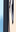
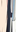

# Example

Original Image

Output Images `width: 16 | height: 32 | n_rows: 8 | n_cols: 4`

  
  
  
  

    
    
    
    

    
    
    
    

    
    
    
    

    
    
    
    

    
    
    
    

    
    
    
    

    
    
    
    

